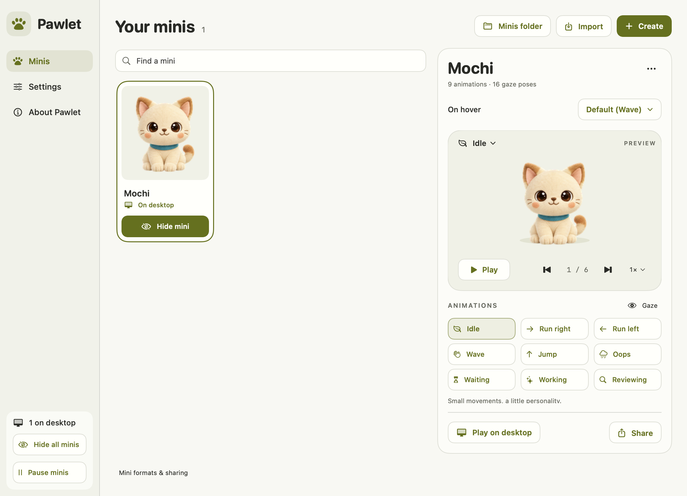

# Pawlet

A quiet, offline Mac app for the characters you want on your desktop.



Pawlet is a native SwiftUI + AppKit app. It runs independently of Codex, has a menu bar control, and supports any compatible character through an open mini-pack format. Mochi is included as an example; adding another mini never requires editing the app.

## Install and use

The current setup is to clone the repository and build locally. You do **not** need a paid Apple Developer account, signing credentials, Codex, Python or an API key to run Pawlet. Requires macOS 13+ and Xcode or its command-line tools:

```sh
# Only if Xcode's command-line tools are not installed:
xcode-select --install

git clone https://github.com/ruzwid/pawlet.git
cd pawlet
bash scripts/build.sh
open build/Pawlet.app
```

The runnable app is **`build/Pawlet.app`** inside your checkout. You can drag it into Applications. Builds support Apple silicon and Intel by default. To update a checkout, quit Pawlet, run `git pull --ff-only`, rebuild, and open the rebuilt app.

The 0.6.3 preview is ad-hoc signed. Developer ID signing and Apple notarization are deferred; no App Store distribution is planned. Downloadable DMG/ZIP previews can be built with `bash scripts/release.sh` or the **Build downloadable preview** GitHub Actions workflow. Until a [GitHub Release](https://github.com/ruzwid/pawlet/releases) is published, cloning and building is the primary installation path. Downloaded previews may need approval in System Settings → Privacy & Security. See [distribution](docs/distribution.md).

The first launch opens **Your minis**. The compact sidebar keeps Minis, Settings and About close at hand. Use **Import** to add a `.petpack`, mini ZIP, Codex mini folder, `pet.json`, or complete compatible PNG atlas. Use **Share** to export a pack, ordinary ZIP, or Codex folder; **Minis folder** in the top toolbar opens the whole library in Finder. To inspect one mini, choose **Options → Show this mini’s files**. Exported files are revealed in Finder too. Double-clicking a `.petpack` also imports it. Hover over a mini for a brief hello, click to wave, double-click to jump, drag to move it, or right-click for its other poses. The paw in the menu bar lets you reopen the library, show/hide minis, pause, or quit. Closing the library keeps the minis running.

**Still by default.** Idle animation, following the cursor, wandering and activity loops are off. Enable each separately in Settings. You can also adjust size from **25% to 175%**, opacity, animation speed, click-through, window level, Spaces, Dock visibility, appearance and launch at login. macOS Reduce Motion takes priority. The library thumbnails stay still. Each card has a **Show mini / Hide mini** button that changes desktop visibility with one click and keeps the current preview selected.

**Explore every animation.** Select a companion, then choose an animation chip or use the preview's animation menu. It loops only in the preview, with play/pause, 0.5×–1.5× speed and frame-by-frame controls. **Gaze** explores the sixteen look poses on v2 minis; v1 minis show the nine animation states. Selecting a mini immediately loads that mini’s artwork and starts with a still image. Preview and thumbnail framing trims transparent margins for display; the stored sprite sheet stays unchanged. Previews stop when you leave the page or hide/minimize the window and respect Reduce Motion. **Play on desktop** explicitly sends the selected animation to the desktop mini.

**Choose the hello.** Settings → **Default hover reaction** offers Wave, Hop toward you, Waiting, Working, Reviewing and Oops. Each mini's **On hover** picker can override that default. Hop toward you plays the Jump row—the same row used by the inspected Codex hover renderer; Paris's artwork makes it look like a forward bounce. The Working row is an active-work animation, not a guaranteed front-running gait. Reactions never move the mini's window.

**Time between animations** adds 0–60 seconds of rest after each enabled idle/activity loop, with a ten-second default. Set zero for continuous playback. Hover greetings play one full animation on entry, not repeatedly under a stationary pointer. Leaving and re-entering can immediately restart any greeting, independently of the loop interval. Turn off **React when I hover** for a still companion. Greetings respect Pause, Reduce Motion and click-through, and do not interrupt dragging or unrelated actions/activities.

Upgrading from the earlier desktop preview copies your existing library and preferences into Pawlet on first launch. The previous app's files remain recoverable. `.petpack` files continue to work unchanged.

## Add any character

A `.petpack` is an ordinary flat ZIP with:

```text
manifest.json       # identity, name, description, sprite version
spritesheet.png     # every animation and gaze pose in one transparent image
preview.png         # optional thumbnail
```

There is no executable mini code. A v2 sheet is 1536 × 2288 with 192 × 208 cells: nine animation rows and sixteen gaze poses. v1 is supported without gaze. A single photograph is a creation reference, not a runnable animated mini. See the [exact format](.agents/skills/create-desktop-pet/references/format.md) and [JSON schema](docs/pet-manifest.schema.json).

### Move minis between Pawlet and Codex

`.petpack` is a recognizable ZIP extension so double-clicking opens Pawlet. It is not a new image format or a requirement for your artwork. **Share → Export ZIP** produces the same portable data with an ordinary `.zip` extension; PNG sprite sheets also work directly.

| Direction | What to do |
| --- | --- |
| Codex → Pawlet | Click **Import** and choose the mini's ZIP, its own folder, or its `pet.json`. The folder must contain `pet.json` beside `spritesheet.png` or `spritesheet.webp`. |
| Pawlet → Codex | Choose a mini, then **Share → Export for Codex…**. Save the new folder under `~/.codex/pets/`, then open Codex **Settings → Minis**, refresh if offered, or restart and select it. |
| Pawlet → another Pawlet | Export a `.petpack` or ZIP and import it on the other Mac. |
| Inspect or use artwork elsewhere | Click **Minis folder** in the top toolbar to browse all minis, or a mini’s **Options → Show this mini’s files**. The library's `spritesheet.png` is the complete atlas, not a thumbnail. |

Codex export contains `pet.json`, `spritesheet.png`, and a Pawlet `manifest.json` to preserve metadata on the return trip. PNG artwork is copied byte for byte. Imported WebP artwork is decoded once to PNG; the original source file remains untouched. Existing destination folders are never overwritten. If your Codex home is customized, select its `minis` directory in the save panel instead.

ZIP import accepts a flat mini or one top-level mini folder, including an optional README. Finder-added `__MACOSX` sidecars and `.DS_Store` files are ignored. It rejects multiple minis, unsafe paths, links, encrypted archives, unexpected files, and source/QA bundles. If you have a larger generation `outputs` folder, choose a **share ZIP** or the individual `spritesheet.png` in the mini's **final** folder. Do not choose a photo, per-row sheet, motion GIF, or the entire generation workspace. Selecting a bare PNG creates a new local ID; importing metadata preserves the mini's ID, name and description.

This Codex folder transfer matches the local desktop format inspected for this app version. It is local, not an account sync service. The documented [mini install link](https://learn.chatgpt.com/docs/reference/commands) requires a hosted HTTPS image; Pawlet keeps your images local. [Desktop and web minis have different upload rules](https://learn.chatgpt.com/docs/pets), so these v2 folders are intended for desktop Codex/ChatGPT rather than web upload.

Runtime imports read only the playable cells; extra poses in unused slots are preserved in the image but never animated. Missing required frames and opaque backgrounds are still rejected. New artwork created by the packaging skill follows the stricter contract with transparent unused cells.

The library can store many minis. **Show all minis / Hide all minis** in the sidebar changes the whole collection with one click; it keeps the selected preview and animation preferences intact. There is no fixed six-mini visibility cap; memory use grows with the number of visible atlases. Minis have stable IDs, so renaming does not lose their saved position. Duplicate IDs are rejected. Remove a mini using **Move to Trash**; its files remain recoverable there.

## Create with Codex

Choose **Create**, describe a character or supply a reference image, then choose **Open in Codex**. The app prepares a local creation workspace with the included [`create-desktop-pet` skill](.agents/skills/create-desktop-pet/SKILL.md), your brief and your reference. It opens a new Codex chat with the prompt filled in. Review and press **Send**; the link does not submit a job automatically. This follows the [documented Codex command interface](https://learn.chatgpt.com/docs/reference/commands).

The style picker starts at **Choose for me**. Codex picks a cohesive style that fits your character and keeps it consistent across every pose. You can still explicitly choose 3D toy, plush, pixel, clay or sticker.

New artwork requires Codex image generation and the installed **Pets plugin**. The repository includes an original standalone packaging skill; the upstream plugin and its generation tools are separate dependencies. The skill uses that pipeline through local artwork validation, then packages a `.petpack` without creating or selecting a hosted ChatGPT pet. Import the resulting pack when it is ready. There is also **Copy prompt** as a fallback. Existing minis continue to work when Codex is closed or uninstalled.

To package an already completed atlas without generating anything:

```sh
python3 -m pip install -r requirements-dev.txt
python3 .agents/skills/create-desktop-pet/scripts/package_pet.py \
  --atlas /path/to/final-atlas.png --name 'Nori' \
  --description 'A small leaf dragon.' --output /path/to/Nori.petpack
```

The helper validates structure and preserves the original PNG bytes. Visual quality and animation direction still need human review.

## Build and contribute

Install Xcode or its command-line tools, then:

```sh
bash scripts/build.sh
open build/Pawlet.app

# Optional development checks (Pillow is only needed by packaging tests):
python3 -m venv .venv
.venv/bin/python -m pip install -r requirements-dev.txt
PYTHON=.venv/bin/python bash scripts/test.sh --ui
```

The build has no downloaded Swift dependencies. By default it compiles a universal binary; use `ARCHS=arm64` or `ARCHS=x86_64` for a faster local build. Python/Pillow are needed only for the pack helper and its tests, never for the app at runtime. Use `bash scripts/release.sh` to create a DMG, app ZIP and SHA-256 checksums in `dist/`.

Read [CONTRIBUTING.md](CONTRIBUTING.md) and the [architecture](docs/architecture.md). GitHub Actions checks both Mac architectures; manual release builds are uploaded as workflow artifacts and do not publish a release automatically. All local user data stays in `~/Library/Application Support/Pawlet/`. No accounts, telemetry, server, API key or accessibility/screen-recording permission is needed to run pets.

## Next milestones

- Sign and notarize the public release; publish versioned GitHub downloads.
- Add library search, tags and per-pet setting overrides when the library grows.
- Add a curated gallery of downloadable packs with attribution and explicit licenses.
- Add opt-in automatic updates after a trusted release channel exists.
- Keep future sprite formats versioned; add new renderers without executing imported code.

This is an independent community app, not an official OpenAI product. Code, creation skill and the included Mochi example use the [MIT license](LICENSE). Imported artwork retains its own rights and is not relicensed by importing it.
